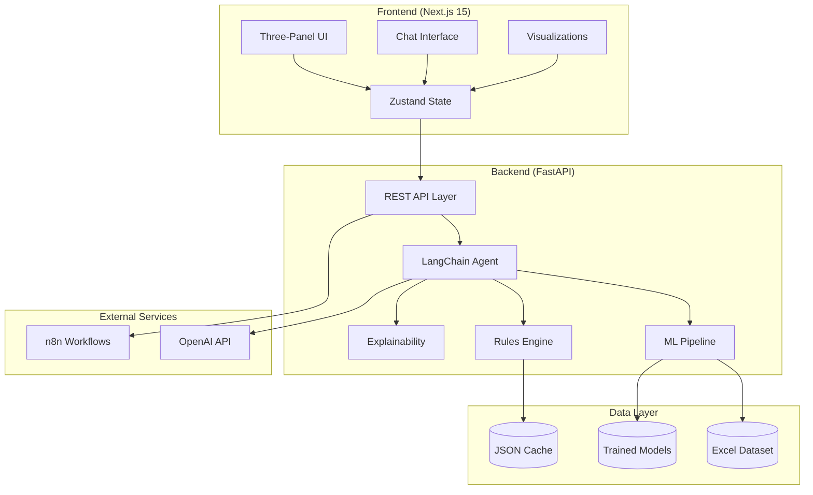
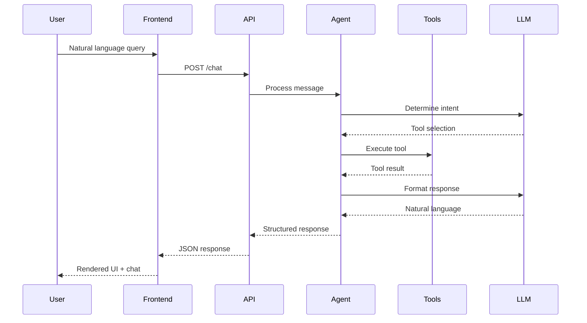
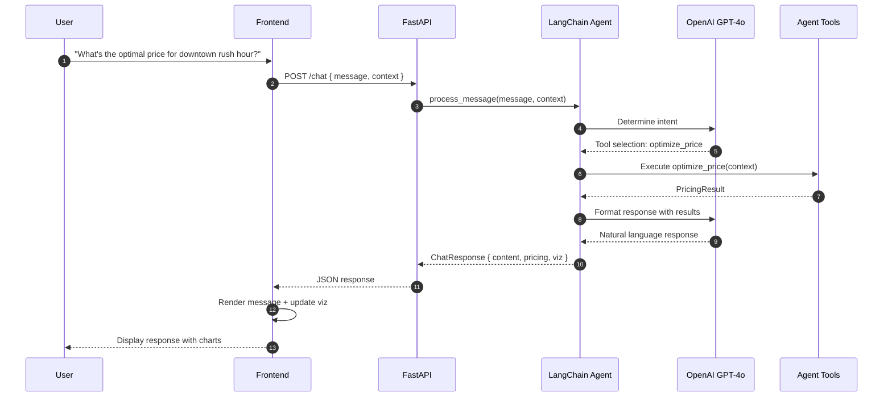
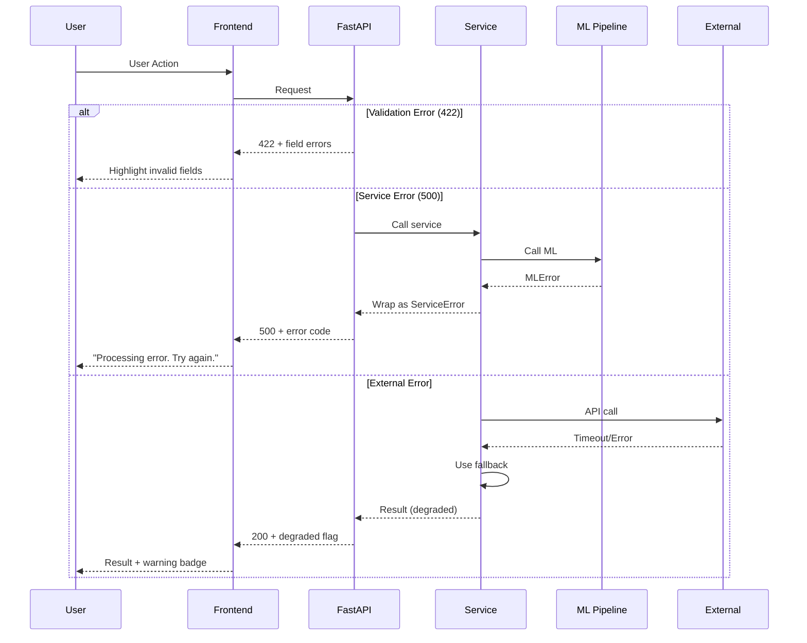

# PrismIQ Full-Stack Architecture Document

## Document Information

| Field | Value |
|-------|-------|
| **Project** | PrismIQ - Agentic Dynamic Pricing Copilot |
| **Version** | 1.0.0 |
| **Last Updated** | December 2024 |
| **Status** | Approved |
| **Architecture Type** | Full-Stack Monorepo |

---

## 1. Introduction

### 1.1 Purpose

This document defines the complete technical architecture for PrismIQ, an agentic, chat-driven dynamic pricing copilot designed for hackathon demonstration. It serves as the authoritative reference for all development decisions.

### 1.2 Scope

- Full-stack monorepo architecture (Next.js frontend + FastAPI backend)
- LangChain-based agent with tool-calling capabilities
- ML pipeline for demand simulation and price optimization
- Local deployment without containerization

### 1.3 Key Design Decisions

| Decision | Choice | Rationale |
|----------|--------|-----------|
| **Architecture Style** | Monolithic fullstack | Simplicity for hackathon; clear boundaries |
| **Package Manager (JS)** | Bun | Fastest runtime, built-in bundler |
| **Package Manager (Python)** | uv | 10-100x faster than pip |
| **Containerization** | None | Simplicity; local development only |
| **Database** | File-based (Excel + JSON) | No external dependencies |
| **LLM Provider** | OpenAI GPT-4o | Best reasoning for agent tasks |

---

## 2. High Level Architecture

### 2.1 Technical Summary

PrismIQ is architected as a **monolithic fullstack application** with clear frontend/backend separation, deployed locally for hackathon demonstration. The system follows a **chat-first, API-driven pattern** where a Next.js 15 frontend communicates with a FastAPI backend that orchestrates ML models through a LangChain agent.

The frontend renders a three-panel collapsible interface with real-time chat, while the backend exposes REST endpoints that the LangChain agent invokes as tools. Price optimization occurs through an ensemble approach combining XGBoost predictions with SHAP-based explainability.

### 2.2 High-Level Component Diagram



### 2.3 Key Design Principles

1. **Chat-First Architecture:** All user interactions flow through the conversational interface. The agent determines when to invoke tools (price optimization, visualization, etc.) based on user intent.

2. **Tool-Based Agent Design:** The LangChain agent exposes backend services as callable tools, enabling natural language-driven actions without hardcoded workflows.

3. **Graceful Degradation:** When external services fail, the system falls back to cached data or synthetic responses, ensuring uninterrupted demo experience.

4. **Type Safety Across Boundaries:** Shared TypeScript types are the source of truth, with Pydantic models mirroring them for runtime validation.

### 2.4 Request Flow Overview



---

## 3. Tech Stack

### 3.1 Technology Stack Table

| Category | Technology | Version | Purpose | Rationale |
|----------|------------|---------|---------|-----------|
| **Frontend Language** | TypeScript | 5.7 | Type-safe JavaScript | Latest stable; strict mode catches errors at compile time |
| **Frontend Framework** | Next.js | 15.1 | React meta-framework | Latest stable (Dec 2024); App Router, Server Components |
| **UI Component Library** | shadcn/ui | latest | Accessible component primitives | Copy-paste components; Radix primitives; full customization |
| **Styling** | Tailwind CSS | 4.0 | Utility-first CSS | v4 stable (Dec 2024); CSS-first config; native cascade layers |
| **State Management** | Zustand | 5.0 | Lightweight React state | Simple API; TypeScript-first; devtools support |
| **Charts** | Recharts | 2.14 | React charting library | Composable; responsive; great defaults |
| **HTTP Client** | ky | 1.7 | Fetch wrapper | Tiny; retry logic; typed responses |
| **JS Runtime** | Bun | 1.1.38+ | JavaScript runtime & package manager | Fastest runtime; built-in bundler; npm compatible |
| **Backend Language** | Python | 3.12 | ML and API development | Latest stable; performance improvements |
| **Backend Framework** | FastAPI | 0.115 | Async Python web framework | Auto OpenAPI; Pydantic v2 native; async-first |
| **ML Framework** | scikit-learn | 1.5 | Machine learning | Stable; XGBoost integration |
| **Gradient Boosting** | XGBoost | 2.1 | Price prediction models | State-of-the-art for tabular data |
| **Explainability** | SHAP | 0.46 | Model interpretation | Industry standard; feature importance |
| **Agent Framework** | LangChain | 0.3 | LLM orchestration | Tool-calling; conversation memory |
| **LLM Provider** | OpenAI | GPT-4o | Large language model | Best reasoning for agentic tasks |
| **Python Package Manager** | uv | 0.5+ | Fast Python package management | 10-100x faster than pip; lockfile support |
| **Python Environment** | venv | built-in | Virtual environment | Standard; no external deps |
| **Data Processing** | Pandas | 2.2 | DataFrame operations | Industry standard; Excel support |
| **Logging** | Loguru | 0.7 | Structured logging | Zero config; beautiful output |
| **Validation** | Pydantic | 2.10 | Data validation | FastAPI native; TypeScript-like |

### 3.2 Package Manager Enforcement

**Frontend (Bun):**
```jsonc
// frontend/package.json
{
  "packageManager": "bun@1.1.38",
  "engines": {
    "bun": ">=1.1.38",
    "node": ">=22.0.0"
  },
  "scripts": {
    "preinstall": "npx only-allow bun"
  }
}
```

**npm/pnpm Disabled:**
```ini
# frontend/.npmrc
engine-strict=true
package-manager-strict=true
```

**Backend (uv with venv):**
```toml
# backend/pyproject.toml
[project]
requires-python = ">=3.12"

[tool.uv]
python-preference = "only-system"
```

### 3.3 Environment Setup

```bash
# Verify Bun (disables npm/pnpm)
cd frontend
bun install  # Creates bun.lockb, ignores package-lock.json

# Python virtual environment with uv
cd backend
uv venv                    # Creates .venv/
source .venv/bin/activate  # Activate
uv pip sync requirements.lock  # Install from lockfile
```

---

## 4. Data Models

### 4.1 MarketContext

**Purpose:** Represents the input context for a pricing request—all the factors that influence optimal price.

```typescript
// packages/shared/src/types/market.ts

export type LocationType = 'Urban' | 'Suburban' | 'Rural';
export type VehicleType = 'Economy' | 'Premium';
export type TimeOfDay = 'Morning' | 'Afternoon' | 'Evening' | 'Night';

export interface MarketContext {
  // Geographic
  location: LocationType;
  
  // Temporal
  timestamp: string;  // ISO 8601
  timeOfDay: TimeOfDay;
  
  // Supply & Demand
  riders: number;     // Current demand (10-100)
  drivers: number;    // Current supply (5-80)
  supplyDemandRatio: number;  // Calculated
  
  // Customer Profile
  customerSegment: string;
  loyaltyTier: 'Bronze' | 'Silver' | 'Gold' | 'Platinum';
  customerLifetimeValue?: number;
  
  // Vehicle
  vehicleType: VehicleType;
  
  // External Factors
  weatherCondition?: string;
  trafficLevel?: number;  // 0-1 scale
  competitorPrices?: number[];
  
  // Event Context
  isSpecialEvent?: boolean;
  eventType?: string;
}
```

### 4.2 PricingResult

**Purpose:** The output of a price optimization request, including the recommended price and all supporting data.

```typescript
// packages/shared/src/types/pricing.ts

export interface PricingResult {
  // Core Output
  recommendedPrice: number;
  basePrice: number;
  multiplier: number;
  
  // Confidence
  confidence: number;  // 0-1
  confidenceInterval: {
    lower: number;
    upper: number;
  };
  
  // Business Metrics
  expectedConversion: number;  // 0-1 probability
  expectedRevenue: number;
  demandAtPrice: number;
  
  // Constraints Applied
  rulesApplied: RuleApplication[];
  priceAdjustments: PriceAdjustment[];
  
  // Explainability
  explanation: PriceExplanation;
  
  // Metadata
  modelVersion: string;
  processingTimeMs: number;
  timestamp: string;
}

export interface RuleApplication {
  ruleId: string;
  ruleName: string;
  triggered: boolean;
  impact: number;  // Price delta
  reason: string;
}

export interface PriceAdjustment {
  factor: string;
  direction: 'increase' | 'decrease';
  magnitude: number;
  reason: string;
}

export interface PriceExplanation {
  narrative: string;  // Human-readable summary
  topFactors: FeatureContribution[];
  demandCurve: DemandPoint[];
  segmentInsights: string[];
}

export interface FeatureContribution {
  feature: string;
  value: number | string;
  impact: number;  // SHAP value
  direction: 'positive' | 'negative';
}

export interface DemandPoint {
  price: number;
  demand: number;
  revenue: number;
}
```

### 4.3 ChatMessage

**Purpose:** Represents a message in the chat conversation, supporting both user and assistant messages with optional tool results.

```typescript
// packages/shared/src/types/chat.ts

export type MessageRole = 'user' | 'assistant' | 'system';

export interface ChatMessage {
  id: string;
  role: MessageRole;
  content: string;
  timestamp: string;
  
  // Optional structured data
  toolResults?: ToolResult[];
  visualizations?: VisualizationType[];
  context?: MarketContext;
  pricing?: PricingResult;
}

export interface ToolResult {
  toolName: string;
  success: boolean;
  result: unknown;
  executionTimeMs: number;
}

export type VisualizationType = 
  | 'demand_curve'
  | 'feature_importance'
  | 'price_comparison'
  | 'segment_analysis'
  | 'scenario_comparison';
```

### 4.4 Scenario

**Purpose:** Represents a saved scenario for comparison and analysis.

```typescript
// packages/shared/src/types/scenario.ts

export interface Scenario {
  id: string;
  name: string;
  description?: string;
  createdAt: string;
  updatedAt: string;
  
  // Input
  context: MarketContext;
  
  // Output
  result: PricingResult;
  
  // Metadata
  tags: string[];
  isFavorite: boolean;
}

export interface ScenarioComparison {
  scenarios: Scenario[];
  comparisonMetrics: ComparisonMetric[];
  insights: string[];
}

export interface ComparisonMetric {
  metric: string;
  values: { scenarioId: string; value: number }[];
  winner: string;  // scenarioId with best value
  difference: number;  // Percentage difference
}
```

---

## 5. API Specification

### 5.1 REST API (OpenAPI 3.1)

```yaml
openapi: 3.1.0
info:
  title: PrismIQ Dynamic Pricing API
  version: 1.0.0
  description: |
    Agentic, chat-driven dynamic pricing copilot API.
    Provides price optimization, explainability, and scenario analysis endpoints.

servers:
  - url: http://localhost:8000
    description: Local development server
  - url: http://localhost:8000/api/v1
    description: Versioned API path

tags:
  - name: Health
    description: System health and status
  - name: Data
    description: Dataset exploration
  - name: Chat
    description: Conversational interface
  - name: Pricing
    description: Price optimization
  - name: Scenarios
    description: Scenario management

paths:
  /health:
    get:
      tags: [Health]
      summary: Health check
      operationId: getHealth
      responses:
        '200':
          description: Service healthy
          content:
            application/json:
              schema:
                $ref: '#/components/schemas/HealthResponse'

  /api/v1/data/summary:
    get:
      tags: [Data]
      summary: Get dataset summary statistics
      operationId: getDataSummary
      responses:
        '200':
          description: Dataset summary
          content:
            application/json:
              schema:
                $ref: '#/components/schemas/DataSummary'

  /api/v1/data/segment/{segment_id}:
    get:
      tags: [Data]
      summary: Get segment details
      operationId: getSegmentDetails
      parameters:
        - name: segment_id
          in: path
          required: true
          schema:
            type: string
      responses:
        '200':
          description: Segment details
          content:
            application/json:
              schema:
                $ref: '#/components/schemas/SegmentDetails'

  /api/v1/chat:
    post:
      tags: [Chat]
      summary: Send chat message
      operationId: sendChatMessage
      requestBody:
        required: true
        content:
          application/json:
            schema:
              $ref: '#/components/schemas/ChatRequest'
      responses:
        '200':
          description: Chat response
          content:
            application/json:
              schema:
                $ref: '#/components/schemas/ChatResponse'

  /api/v1/chat/stream:
    post:
      tags: [Chat]
      summary: Stream chat response
      operationId: streamChatMessage
      requestBody:
        required: true
        content:
          application/json:
            schema:
              $ref: '#/components/schemas/ChatRequest'
      responses:
        '200':
          description: SSE stream
          content:
            text/event-stream:
              schema:
                type: string

  /api/v1/optimize_price:
    post:
      tags: [Pricing]
      summary: Optimize price for market context
      operationId: optimizePrice
      requestBody:
        required: true
        content:
          application/json:
            schema:
              $ref: '#/components/schemas/PricingRequest'
      responses:
        '200':
          description: Pricing result
          content:
            application/json:
              schema:
                $ref: '#/components/schemas/PricingResult'

  /api/v1/scenarios:
    get:
      tags: [Scenarios]
      summary: List saved scenarios
      operationId: listScenarios
      responses:
        '200':
          description: Scenario list
          content:
            application/json:
              schema:
                type: array
                items:
                  $ref: '#/components/schemas/Scenario'
    post:
      tags: [Scenarios]
      summary: Create scenario
      operationId: createScenario
      requestBody:
        required: true
        content:
          application/json:
            schema:
              $ref: '#/components/schemas/CreateScenarioRequest'
      responses:
        '201':
          description: Created scenario
          content:
            application/json:
              schema:
                $ref: '#/components/schemas/Scenario'

  /api/v1/scenarios/{scenario_id}:
    get:
      tags: [Scenarios]
      summary: Get scenario by ID
      operationId: getScenario
      parameters:
        - name: scenario_id
          in: path
          required: true
          schema:
            type: string
      responses:
        '200':
          description: Scenario details
          content:
            application/json:
              schema:
                $ref: '#/components/schemas/Scenario'
    delete:
      tags: [Scenarios]
      summary: Delete scenario
      operationId: deleteScenario
      parameters:
        - name: scenario_id
          in: path
          required: true
          schema:
            type: string
      responses:
        '204':
          description: Deleted

  /api/v1/scenarios/compare:
    post:
      tags: [Scenarios]
      summary: Compare scenarios
      operationId: compareScenarios
      requestBody:
        required: true
        content:
          application/json:
            schema:
              $ref: '#/components/schemas/CompareRequest'
      responses:
        '200':
          description: Comparison results
          content:
            application/json:
              schema:
                $ref: '#/components/schemas/ScenarioComparison'

components:
  schemas:
    HealthResponse:
      type: object
      properties:
        status:
          type: string
          enum: [healthy, degraded, unhealthy]
        version:
          type: string
        timestamp:
          type: string
          format: date-time
        checks:
          type: object
          additionalProperties:
            type: boolean

    ChatRequest:
      type: object
      required: [message]
      properties:
        message:
          type: string
        conversationId:
          type: string
        context:
          $ref: '#/components/schemas/MarketContext'

    ChatResponse:
      type: object
      properties:
        id:
          type: string
        role:
          type: string
          enum: [assistant]
        content:
          type: string
        toolResults:
          type: array
          items:
            $ref: '#/components/schemas/ToolResult'
        visualizations:
          type: array
          items:
            type: string
        pricing:
          $ref: '#/components/schemas/PricingResult'

    PricingRequest:
      type: object
      required: [context]
      properties:
        context:
          $ref: '#/components/schemas/MarketContext'

    # Additional schemas match TypeScript interfaces above
    MarketContext:
      type: object
      properties:
        location:
          type: string
          enum: [Urban, Suburban, Rural]
        timestamp:
          type: string
          format: date-time
        timeOfDay:
          type: string
          enum: [Morning, Afternoon, Evening, Night]
        riders:
          type: integer
          minimum: 10
          maximum: 100
        drivers:
          type: integer
          minimum: 5
          maximum: 80
        supplyDemandRatio:
          type: number
        customerSegment:
          type: string
        loyaltyTier:
          type: string
          enum: [Bronze, Silver, Gold, Platinum]
        vehicleType:
          type: string
          enum: [Economy, Premium]

    PricingResult:
      type: object
      properties:
        recommendedPrice:
          type: number
        basePrice:
          type: number
        multiplier:
          type: number
        confidence:
          type: number
        explanation:
          $ref: '#/components/schemas/PriceExplanation'

    PriceExplanation:
      type: object
      properties:
        narrative:
          type: string
        topFactors:
          type: array
          items:
            $ref: '#/components/schemas/FeatureContribution'

    FeatureContribution:
      type: object
      properties:
        feature:
          type: string
        value:
          oneOf:
            - type: string
            - type: number
        impact:
          type: number
        direction:
          type: string
          enum: [positive, negative]

    ToolResult:
      type: object
      properties:
        toolName:
          type: string
        success:
          type: boolean
        result:
          type: object
        executionTimeMs:
          type: number

    Scenario:
      type: object
      properties:
        id:
          type: string
        name:
          type: string
        context:
          $ref: '#/components/schemas/MarketContext'
        result:
          $ref: '#/components/schemas/PricingResult'

    DataSummary:
      type: object
      properties:
        totalRecords:
          type: integer
        segments:
          type: array
          items:
            type: string
        priceRange:
          type: object
          properties:
            min:
              type: number
            max:
              type: number
            mean:
              type: number

    SegmentDetails:
      type: object
      properties:
        segmentId:
          type: string
        recordCount:
          type: integer
        avgPrice:
          type: number
        characteristics:
          type: object

    CreateScenarioRequest:
      type: object
      required: [name, context]
      properties:
        name:
          type: string
        description:
          type: string
        context:
          $ref: '#/components/schemas/MarketContext'

    CompareRequest:
      type: object
      required: [scenarioIds]
      properties:
        scenarioIds:
          type: array
          items:
            type: string
          minItems: 2
          maxItems: 5

    ScenarioComparison:
      type: object
      properties:
        scenarios:
          type: array
          items:
            $ref: '#/components/schemas/Scenario'
        insights:
          type: array
          items:
            type: string
```

---

## 6. Components

### 6.1 Backend Components

#### API Layer

**Responsibility:** HTTP request handling, routing, validation, and response formatting.

**Key Interfaces:**
- `POST /optimize_price` → PricingRouter
- `POST /chat` → ChatRouter
- `GET /health` → HealthRouter

**Dependencies:** All backend services (injected)

**Technology:** FastAPI routers, Pydantic models, CORS middleware

```
backend/src/api/
├── __init__.py
├── main.py              # FastAPI app factory
├── dependencies.py      # DI container
├── middleware/
│   ├── cors.py
│   ├── logging.py
│   └── timing.py
└── routers/
    ├── health.py
    ├── data.py
    ├── chat.py
    ├── pricing.py
    └── scenarios.py
```

#### LangChain Agent

**Responsibility:** Orchestrates conversation flow, determines user intent, invokes appropriate tools, formats responses.

**Key Interfaces:**
- `process_message(message, context) → AgentResponse`
- `stream_message(message, context) → AsyncGenerator[str]`

**Tools Exposed:**
- `optimize_price`: Get optimal price for context
- `analyze_segment`: Deep dive into customer segment
- `compare_scenarios`: Compare multiple scenarios
- `get_demand_curve`: Fetch demand elasticity data
- `explain_factors`: Get SHAP-based explanations

**Technology:** LangChain 0.3, OpenAI GPT-4o, Tool-calling pattern

```
backend/src/agent/
├── __init__.py
├── agent.py             # Main agent class
├── tools/
│   ├── __init__.py
│   ├── pricing_tool.py
│   ├── analysis_tool.py
│   ├── scenario_tool.py
│   └── visualization_tool.py
├── prompts/
│   ├── system.py
│   └── templates.py
└── memory/
    └── conversation.py
```

#### ML Pipeline

**Responsibility:** Data loading, model training, prediction, and demand simulation.

**Key Interfaces:**
- `ModelManager.predict(context) → PricePrediction`
- `DemandSimulator.simulate(price_range, context) → DemandCurve`
- `Segmenter.classify(context) → SegmentResult`

**Models:**
- XGBoost regressor for price prediction
- Demand elasticity model per segment
- Customer segmentation classifier

**Technology:** scikit-learn, XGBoost, pandas, numpy

```
backend/src/ml/
├── __init__.py
├── model_manager.py     # Model loading and inference
├── demand_simulator.py  # Demand curve generation
├── segmenter.py         # Customer segmentation
├── preprocessor.py      # Feature engineering
└── models/              # Serialized models (.joblib)
    ├── price_predictor.joblib
    ├── demand_model.joblib
    └── segmenter.joblib
```

#### Services

**Responsibility:** Business logic encapsulation, orchestration between ML and rules.

```
backend/src/services/
├── __init__.py
├── pricing_service.py   # Price optimization orchestration
├── data_service.py      # Dataset access and summaries
├── scenario_service.py  # Scenario CRUD operations
└── external_service.py  # n8n webhook integration
```

#### Rules Engine

**Responsibility:** Apply business constraints and guardrails to ML predictions.

**Key Interfaces:**
- `evaluate(prediction, context) → RulesResult`

**Rules:**
- Max surge multiplier (3.0x)
- Loyalty discounts (5-20% by tier)
- Floor/ceiling prices by segment
- Competition-based adjustments

```
backend/src/rules/
├── __init__.py
├── engine.py           # Rule evaluation engine
├── rules/
│   ├── surge_limits.py
│   ├── loyalty.py
│   ├── price_bounds.py
│   └── competition.py
└── config.yaml         # Rule parameters
```

#### Explainability

**Responsibility:** Generate human-readable explanations for pricing decisions.

**Key Interfaces:**
- `explain(prediction, context) → PriceExplanation`

**Technology:** SHAP, custom narrative generation

```
backend/src/explainability/
├── __init__.py
├── shap_explainer.py   # SHAP value calculation
├── narrative.py        # Natural language generation
└── visualizations.py   # Chart data preparation
```

### 6.2 Frontend Components

#### App Shell

**Responsibility:** Root layout, navigation, and global providers.

```
frontend/src/app/
├── layout.tsx          # Root layout with providers
├── page.tsx            # Redirect to /workspace
├── workspace/page.tsx  # Main analyst workspace
├── executive/page.tsx  # Executive summary view
└── evidence/page.tsx   # Evidence & methods view
```

#### Chat Components

**Responsibility:** Conversational interface, message rendering, input handling.

```
frontend/src/components/chat/
├── ChatPanel.tsx       # Main chat container
├── MessageList.tsx     # Message history
├── Message.tsx         # Individual message
├── ChatInput.tsx       # User input with suggestions
├── ToolResult.tsx      # Tool execution display
└── StreamingMessage.tsx # Animated typing effect
```

#### Visualization Components

**Responsibility:** Data visualization and chart rendering.

```
frontend/src/components/visualizations/
├── DemandCurve.tsx     # Demand elasticity chart
├── FeatureImportance.tsx # SHAP waterfall chart
├── PriceComparison.tsx # Scenario comparison
├── SegmentAnalysis.tsx # Segment breakdown
└── OptimalPriceGauge.tsx # Price recommendation dial
```

#### Context Components

**Responsibility:** Market context input and management.

```
frontend/src/components/context/
├── ContextPanel.tsx    # Collapsible context panel
├── LocationSelector.tsx
├── DemandSliders.tsx   # Riders/drivers inputs
├── CustomerProfile.tsx # Segment and loyalty
└── ScenarioManager.tsx # Save/load scenarios
```

---

## 7. External APIs

### 7.1 OpenAI API (LLM Provider)

- **Purpose:** Powers the LangChain agent's natural language understanding and response generation
- **Documentation:** https://platform.openai.com/docs/api-reference
- **Base URL:** `https://api.openai.com/v1`
- **Authentication:** Bearer token (`OPENAI_API_KEY` env var)
- **Rate Limits:** Tier-dependent; typically 3,500 RPM for GPT-4o

**Key Endpoints:**
- `POST /chat/completions` - Agent reasoning and response generation

**Integration Notes:**
- Use GPT-4o for best tool-calling performance
- Temperature: 0.7 for conversational, 0.3 for structured outputs
- Max tokens: 2048 for responses, 4096 for complex analyses

**Error Handling:**
- 429 (Rate Limited): Exponential backoff with jitter
- 503 (Overloaded): Fallback to cached response or GPT-4o-mini
- Timeout (30s): Return graceful error with retry option

### 7.2 n8n Webhook (External Data Enrichment)

- **Purpose:** Fetches real-time external data (weather, events, traffic) and caches results
- **Base URL:** `http://localhost:5678/webhook/`
- **Authentication:** None (local development)

**Webhooks:**
- `POST /webhook/weather` - Current weather conditions
- `POST /webhook/events` - Local event detection
- `POST /webhook/traffic` - Traffic density estimation

**Response Caching:**
- Weather: 30 minutes TTL
- Events: 1 hour TTL
- Traffic: 5 minutes TTL

**Fallback Behavior:**
When n8n is unavailable, the system uses synthetic data:
- Weather: "Clear" (neutral impact)
- Events: None (no special event multiplier)
- Traffic: 0.5 (moderate)

---

## 8. Core Workflows

### 8.1 Price Optimization Workflow

```mermaid
sequenceDiagram
    autonumber
    participant U as User
    participant FE as Frontend
    participant API as FastAPI
    participant SEG as Segmenter
    participant SIM as Demand Simulator
    participant ML as Model Manager
    participant OPT as Price Optimizer
    participant RULES as Rules Engine
    participant EXP as Explainability

    U->>FE: Submit market context
    FE->>API: POST /optimize_price
    API->>SEG: Classify customer segment
    SEG-->>API: SegmentResult
    
    API->>SIM: Generate demand curves
    SIM-->>API: DemandCurve[]
    
    API->>ML: Predict base price
    ML-->>API: PricePrediction
    
    API->>OPT: Find optimal price point
    OPT->>OPT: Maximize expected revenue
    OPT-->>API: OptimalPrice
    
    API->>RULES: Apply business constraints
    RULES-->>API: AdjustedPrice + RulesApplied
    
    API->>EXP: Generate explanation
    EXP-->>API: PriceExplanation
    
    API-->>FE: PricingResult
    FE-->>U: Display recommendation + viz
```

### 8.2 Chat Interaction Workflow



### 8.3 Scenario Comparison Workflow

```mermaid
sequenceDiagram
    autonumber
    participant U as User
    participant FE as Frontend
    participant API as FastAPI
    participant SVC as Scenario Service
    participant OPT as Price Optimizer

    U->>FE: Select scenarios to compare
    FE->>API: POST /scenarios/compare { ids }
    API->>SVC: Load scenarios
    SVC-->>API: Scenario[]
    
    loop For each scenario
        API->>OPT: Recalculate if needed
        OPT-->>API: Updated result
    end
    
    API->>API: Calculate comparison metrics
    API->>API: Generate insights
    API-->>FE: ScenarioComparison
    FE-->>U: Display comparison table + insights
```

---

## 9. Database Schema

Per the architecture decisions, PrismIQ uses **file-based storage** rather than a traditional database.

### 9.1 Source Dataset Schema (dynamic_pricing.xlsx)

```sql
-- Conceptual schema (actual storage is Excel)

TABLE dynamic_pricing (
    -- Row identifier (implicit)
    row_id              INTEGER PRIMARY KEY,
    
    -- Supply & Demand
    Number_of_Riders    INTEGER NOT NULL,      -- Range: 10-100
    Number_of_Drivers   INTEGER NOT NULL,      -- Range: 5-80
    
    -- Location & Time
    Location_Category   VARCHAR(20) NOT NULL,  -- Urban|Suburban|Rural
    Time_of_Booking     VARCHAR(10) NOT NULL,  -- Morning|Afternoon|Evening|Night
    
    -- Customer Profile
    Customer_Loyalty_Status VARCHAR(10) NOT NULL,  -- Bronze|Silver|Gold|Platinum
    
    -- Vehicle
    Vehicle_Type        VARCHAR(10) NOT NULL,  -- Economy|Premium
    
    -- External Factors
    Historical_Cost_of_Ride DECIMAL(6,2) NOT NULL,  -- Range: ~8-50
    Expected_Ride_Duration  INTEGER NOT NULL,      -- Minutes: 10-60
    
    -- Target Variable
    Adjusted_Ride_Cost  DECIMAL(6,2) NOT NULL  -- Dynamic price target
);

-- Derived features (calculated at runtime)
-- supply_demand_ratio = Number_of_Drivers / Number_of_Riders
-- is_surge = supply_demand_ratio < 0.5
-- segment_id = f"{Location_Category}_{Customer_Loyalty_Status}_{Vehicle_Type}"
```

### 9.2 Serialized Models Schema

```yaml
# backend/data/models/model_metadata.yaml

models:
  price_predictor:
    file: price_predictor.joblib
    type: XGBRegressor
    version: "1.0.0"
    trained_at: "2024-01-15T10:30:00Z"
    features:
      - supply_demand_ratio
      - location_encoded
      - time_encoded
      - loyalty_encoded
      - vehicle_encoded
      - historical_cost
      - expected_duration
    metrics:
      rmse: 2.34
      mae: 1.89
      r2: 0.923
    
  demand_model:
    file: demand_model.joblib
    type: ElasticityModel
    version: "1.0.0"
    segments:
      - Urban_Premium
      - Urban_Economy
      - Suburban_Premium
      - Suburban_Economy
      - Rural_Premium
      - Rural_Economy
    
  segmenter:
    file: segmenter.joblib
    type: KMeans
    version: "1.0.0"
    n_clusters: 6
    features:
      - location_encoded
      - loyalty_encoded
      - vehicle_encoded
```

### 9.3 Scenario Storage Schema (JSON)

```json
// backend/data/scenarios/{scenario_id}.json
{
  "id": "550e8400-e29b-41d4-a716-446655440000",
  "name": "Downtown Rush Hour Premium",
  "description": "Peak demand scenario for premium vehicles",
  "createdAt": "2024-01-20T14:30:00Z",
  "updatedAt": "2024-01-20T14:30:00Z",
  "context": {
    "location": "Urban",
    "timestamp": "2024-01-20T17:30:00Z",
    "timeOfDay": "Evening",
    "riders": 85,
    "drivers": 25,
    "supplyDemandRatio": 0.29,
    "customerSegment": "Urban_Gold_Premium",
    "loyaltyTier": "Gold",
    "vehicleType": "Premium"
  },
  "result": {
    "recommendedPrice": 42.50,
    "basePrice": 28.00,
    "multiplier": 1.52,
    "confidence": 0.89,
    "explanation": {
      "narrative": "High surge pricing recommended due to...",
      "topFactors": [...]
    }
  },
  "tags": ["rush-hour", "premium", "high-demand"],
  "isFavorite": true
}
```

---

## 10. Frontend Architecture

### 10.1 Component Organization

```
frontend/src/
├── app/                          # Next.js App Router
│   ├── layout.tsx                # Root layout with providers
│   ├── page.tsx                  # Home → redirect to /workspace
│   ├── workspace/
│   │   └── page.tsx              # Analyst Workspace
│   ├── executive/
│   │   └── page.tsx              # Executive Summary
│   └── evidence/
│       └── page.tsx              # Evidence & Methods
│
├── components/
│   ├── ui/                       # shadcn/ui components
│   │   ├── button.tsx
│   │   ├── card.tsx
│   │   ├── input.tsx
│   │   └── ...
│   ├── chat/                     # Chat interface
│   │   ├── ChatPanel.tsx
│   │   ├── MessageList.tsx
│   │   ├── Message.tsx
│   │   └── ChatInput.tsx
│   ├── context/                  # Market context inputs
│   │   ├── ContextPanel.tsx
│   │   ├── LocationSelector.tsx
│   │   └── DemandSliders.tsx
│   ├── visualizations/           # Charts and data viz
│   │   ├── DemandCurve.tsx
│   │   ├── FeatureImportance.tsx
│   │   └── PriceGauge.tsx
│   └── layout/                   # Layout components
│       ├── Header.tsx
│       ├── Sidebar.tsx
│       └── ThreePanel.tsx
│
├── hooks/                        # Custom React hooks
│   ├── useChat.ts
│   ├── useOptimizePrice.ts
│   └── useScenarios.ts
│
├── services/                     # API client layer
│   ├── api.ts                    # Base API configuration
│   ├── chat.service.ts
│   ├── pricing.service.ts
│   └── scenarios.service.ts
│
├── stores/                       # Zustand state stores
│   ├── chatStore.ts
│   ├── contextStore.ts
│   └── scenarioStore.ts
│
├── lib/                          # Utilities
│   ├── utils.ts                  # General utilities
│   └── cn.ts                     # Class name helper
│
└── types/                        # Local type extensions
    └── index.ts
```

### 10.2 State Management (Zustand)

```typescript
// stores/chatStore.ts
import { create } from 'zustand';
import { persist } from 'zustand/middleware';
import type { ChatMessage } from '@prismiq/shared';

interface ChatState {
  messages: ChatMessage[];
  isLoading: boolean;
  conversationId: string | null;
  
  // Actions
  addMessage: (message: ChatMessage) => void;
  clearMessages: () => void;
  setLoading: (loading: boolean) => void;
}

export const useChatStore = create<ChatState>()(
  persist(
    (set) => ({
      messages: [],
      isLoading: false,
      conversationId: null,
      
      addMessage: (message) =>
        set((state) => ({
          messages: [...state.messages, message],
        })),
      
      clearMessages: () =>
        set({ messages: [], conversationId: null }),
      
      setLoading: (loading) =>
        set({ isLoading: loading }),
    }),
    {
      name: 'prismiq-chat',
    }
  )
);
```

### 10.3 Routing Strategy

```typescript
// App Router structure
// All routes use server components by default
// Client components marked with 'use client'

const routes = {
  '/': {
    redirect: '/workspace',
  },
  '/workspace': {
    component: 'WorkspacePage',
    layout: 'ThreePanelLayout',
    description: 'Main analyst interface with chat + context + viz',
  },
  '/executive': {
    component: 'ExecutivePage',
    layout: 'SinglePanelLayout',
    description: 'Executive summary dashboard',
  },
  '/evidence': {
    component: 'EvidencePage',
    layout: 'SinglePanelLayout',
    description: 'Methodology and technical details',
  },
};
```

### 10.4 API Integration Pattern

```typescript
// services/api.ts
import ky from 'ky';

const API_BASE = process.env.NEXT_PUBLIC_API_URL || 'http://localhost:8000';

export const api = ky.create({
  prefixUrl: API_BASE,
  timeout: 30000,
  hooks: {
    beforeRequest: [
      (request) => {
        request.headers.set('Content-Type', 'application/json');
      },
    ],
    afterResponse: [
      async (request, options, response) => {
        if (!response.ok) {
          const error = await response.json();
          throw new APIError(error.detail, response.status);
        }
      },
    ],
  },
});

// services/pricing.service.ts
import { api } from './api';
import type { MarketContext, PricingResult } from '@prismiq/shared';

export const pricingService = {
  async optimizePrice(context: MarketContext): Promise<PricingResult> {
    return api.post('api/v1/optimize_price', {
      json: { context },
    }).json();
  },
};
```

---

## 11. Backend Architecture

### 11.1 Service Architecture

```
backend/
├── src/
│   ├── __init__.py
│   ├── main.py                   # FastAPI app factory
│   ├── config.py                 # Settings (pydantic-settings)
│   │
│   ├── api/                      # HTTP layer
│   │   ├── __init__.py
│   │   ├── dependencies.py       # Dependency injection
│   │   ├── middleware/
│   │   │   ├── __init__.py
│   │   │   ├── cors.py
│   │   │   ├── logging.py
│   │   │   └── timing.py
│   │   └── routers/
│   │       ├── __init__.py
│   │       ├── health.py
│   │       ├── data.py
│   │       ├── chat.py
│   │       ├── pricing.py
│   │       └── scenarios.py
│   │
│   ├── services/                 # Business logic
│   │   ├── __init__.py
│   │   ├── pricing_service.py
│   │   ├── data_service.py
│   │   ├── scenario_service.py
│   │   └── external_service.py
│   │
│   ├── agent/                    # LangChain agent
│   │   ├── __init__.py
│   │   ├── agent.py
│   │   ├── tools/
│   │   │   ├── __init__.py
│   │   │   ├── pricing_tool.py
│   │   │   ├── analysis_tool.py
│   │   │   └── scenario_tool.py
│   │   └── prompts/
│   │       ├── system.py
│   │       └── templates.py
│   │
│   ├── ml/                       # Machine learning
│   │   ├── __init__.py
│   │   ├── model_manager.py
│   │   ├── demand_simulator.py
│   │   ├── segmenter.py
│   │   └── preprocessor.py
│   │
│   ├── rules/                    # Business rules
│   │   ├── __init__.py
│   │   ├── engine.py
│   │   └── rules/
│   │       ├── surge_limits.py
│   │       ├── loyalty.py
│   │       └── price_bounds.py
│   │
│   ├── explainability/           # SHAP + narratives
│   │   ├── __init__.py
│   │   ├── shap_explainer.py
│   │   └── narrative.py
│   │
│   └── schemas/                  # Pydantic models
│       ├── __init__.py
│       ├── market.py
│       ├── pricing.py
│       ├── chat.py
│       └── scenario.py
│
├── data/
│   ├── dynamic_pricing.xlsx      # Source dataset
│   ├── models/                   # Trained models
│   │   ├── price_predictor.joblib
│   │   ├── demand_model.joblib
│   │   └── segmenter.joblib
│   └── scenarios/                # Saved scenarios (JSON)
│
├── tests/
│   ├── __init__.py
│   ├── conftest.py
│   ├── unit/
│   │   ├── test_ml/
│   │   ├── test_rules/
│   │   └── test_services/
│   └── integration/
│       ├── test_api/
│       └── test_agent/
│
├── pyproject.toml                # Project config
├── requirements.lock             # Locked dependencies
└── .python-version               # Python version (3.12)
```

### 11.2 Dependency Injection

```python
# src/api/dependencies.py
from functools import lru_cache
from src.config import Settings
from src.ml.model_manager import ModelManager
from src.ml.demand_simulator import DemandSimulator
from src.ml.segmenter import Segmenter
from src.rules.engine import RulesEngine
from src.explainability.shap_explainer import ShapExplainer
from src.services.pricing_service import PricingService

@lru_cache
def get_settings() -> Settings:
    return Settings()

@lru_cache
def get_model_manager() -> ModelManager:
    return ModelManager()

@lru_cache
def get_demand_simulator() -> DemandSimulator:
    return DemandSimulator()

@lru_cache
def get_segmenter() -> Segmenter:
    return Segmenter()

@lru_cache
def get_rules_engine() -> RulesEngine:
    return RulesEngine()

@lru_cache
def get_shap_explainer() -> ShapExplainer:
    return ShapExplainer(get_model_manager())

def get_pricing_service(
    model_manager: ModelManager = Depends(get_model_manager),
    demand_simulator: DemandSimulator = Depends(get_demand_simulator),
    segmenter: Segmenter = Depends(get_segmenter),
    rules_engine: RulesEngine = Depends(get_rules_engine),
    explainer: ShapExplainer = Depends(get_shap_explainer),
) -> PricingService:
    return PricingService(
        model_manager=model_manager,
        demand_simulator=demand_simulator,
        segmenter=segmenter,
        rules_engine=rules_engine,
        explainer=explainer,
    )
```

### 11.3 Configuration Management

```python
# src/config.py
from pydantic_settings import BaseSettings
from pydantic import Field

class Settings(BaseSettings):
    # API
    api_host: str = "0.0.0.0"
    api_port: int = 8000
    debug: bool = False
    
    # OpenAI
    openai_api_key: str = Field(..., env="OPENAI_API_KEY")
    openai_model: str = "gpt-4o"
    openai_temperature: float = 0.7
    
    # n8n
    n8n_webhook_base: str = "http://localhost:5678/webhook"
    n8n_enabled: bool = True
    
    # Paths
    data_path: str = "data/dynamic_pricing.xlsx"
    models_path: str = "data/models"
    scenarios_path: str = "data/scenarios"
    
    # Pricing
    max_surge_multiplier: float = 3.0
    min_price: float = 5.0
    max_price: float = 200.0
    
    # Logging
    log_level: str = "INFO"
    
    class Config:
        env_file = ".env"
        env_file_encoding = "utf-8"
```

---

## 12. Unified Project Structure

```plaintext
prismiq/
├── .github/
│   └── workflows/
│       └── ci.yaml                 # Future CI/CD
│
├── backend/                        # Python FastAPI
│   ├── src/
│   │   ├── __init__.py
│   │   ├── main.py
│   │   ├── config.py
│   │   ├── api/
│   │   │   ├── __init__.py
│   │   │   ├── dependencies.py
│   │   │   ├── middleware/
│   │   │   └── routers/
│   │   ├── services/
│   │   ├── agent/
│   │   │   ├── agent.py
│   │   │   ├── tools/
│   │   │   └── prompts/
│   │   ├── ml/
│   │   │   ├── model_manager.py
│   │   │   ├── demand_simulator.py
│   │   │   ├── segmenter.py
│   │   │   └── preprocessor.py
│   │   ├── rules/
│   │   ├── explainability/
│   │   └── schemas/
│   ├── data/
│   │   ├── dynamic_pricing.xlsx
│   │   ├── models/
│   │   └── scenarios/
│   ├── tests/
│   │   ├── conftest.py
│   │   ├── unit/
│   │   └── integration/
│   ├── pyproject.toml
│   ├── requirements.lock
│   ├── .python-version
│   └── .env.example
│
├── frontend/                       # Next.js 15
│   ├── src/
│   │   ├── app/
│   │   │   ├── layout.tsx
│   │   │   ├── page.tsx
│   │   │   ├── workspace/
│   │   │   ├── executive/
│   │   │   └── evidence/
│   │   ├── components/
│   │   │   ├── ui/
│   │   │   ├── chat/
│   │   │   ├── context/
│   │   │   ├── visualizations/
│   │   │   └── layout/
│   │   ├── hooks/
│   │   ├── services/
│   │   ├── stores/
│   │   ├── lib/
│   │   └── types/
│   ├── public/
│   │   ├── fonts/
│   │   └── images/
│   ├── tests/
│   │   ├── unit/
│   │   └── e2e/
│   ├── package.json
│   ├── bun.lockb
│   ├── tsconfig.json
│   ├── tailwind.config.ts
│   ├── next.config.ts
│   ├── .npmrc
│   └── .env.local.example
│
├── packages/                       # Shared code
│   └── shared/
│       ├── src/
│       │   ├── types/
│       │   │   ├── index.ts
│       │   │   ├── market.ts
│       │   │   ├── pricing.ts
│       │   │   ├── chat.ts
│       │   │   └── scenario.ts
│       │   └── constants/
│       │       └── index.ts
│       ├── package.json
│       └── tsconfig.json
│
├── docs/                           # Documentation
│   ├── brief.md
│   ├── prd.md
│   ├── architecture.md             # This document
│   └── api/
│       └── openapi.yaml
│
├── scripts/                        # Development scripts
│   ├── setup.sh                    # Initial setup
│   ├── dev.sh                      # Start both services
│   └── train-models.py             # ML model training
│
├── .gitignore
├── .env.example
├── README.md
└── Makefile                        # Common commands
```

---

## 13. Development Workflow

### 13.1 Prerequisites

```bash
# Required software
bun --version       # v1.1.38+
python3.12 --version # v3.12.x
uv --version        # v0.5.x+

# Install (macOS)
curl -fsSL https://bun.sh/install | bash
brew install pyenv
pyenv install 3.12.7
pyenv global 3.12.7
curl -LsSf https://astral.sh/uv/install.sh | sh
```

### 13.2 Initial Setup

```bash
# Clone and setup
git clone <repo>
cd prismiq

# Backend setup
cd backend
uv venv
source .venv/bin/activate
uv pip sync requirements.lock
cp .env.example .env
# Add OPENAI_API_KEY to .env

# Frontend setup
cd ../frontend
bun install
cp .env.local.example .env.local

# Shared package
cd ../packages/shared
bun install
bun run build
```

### 13.3 Development Commands

```bash
# Start both services (from root)
make dev

# Or individually:
# Backend (from backend/)
source .venv/bin/activate
uvicorn src.main:app --reload --port 8000

# Frontend (from frontend/)
bun run dev

# Run tests
make test

# Type check
make typecheck

# Lint
make lint
```

### 13.4 Environment Variables

```bash
# backend/.env
OPENAI_API_KEY=sk-...
OPENAI_MODEL=gpt-4o
N8N_WEBHOOK_BASE=http://localhost:5678/webhook
DEBUG=true
LOG_LEVEL=DEBUG

# frontend/.env.local
NEXT_PUBLIC_API_URL=http://localhost:8000
```

---

## 14. Deployment Architecture

### 14.1 Local Deployment (Hackathon)

```yaml
Frontend:
  Platform: Local (Bun)
  Build: bun run build
  Start: bun run start
  Port: 3000

Backend:
  Platform: Local (uvicorn)
  Start: uvicorn src.main:app --host 0.0.0.0 --port 8000
  Port: 8000

n8n (optional):
  Platform: Local
  Start: n8n start
  Port: 5678
```

**Quick Start:**
```bash
# Terminal 1 - Backend
cd backend && source .venv/bin/activate
uvicorn src.main:app --reload --port 8000

# Terminal 2 - Frontend
cd frontend && bun run dev

# Access at http://localhost:3000
```

### 14.2 Production Reference Architecture

```yaml
# Future deployment (out of scope for hackathon)
Frontend:
  Platform: Vercel
  Framework: Next.js
  CDN: Vercel Edge Network

Backend:
  Platform: Railway / Render
  Runtime: Python 3.12
  Workers: 2-4 (gunicorn + uvicorn)

Database:
  Platform: Supabase (PostgreSQL)
  
ML Models:
  Storage: S3 / Cloudflare R2
  
LLM:
  Provider: OpenAI API
  Fallback: Azure OpenAI
```

---

## 15. Security and Performance

### 15.1 Security Requirements

```yaml
Frontend:
  XSS Prevention:
    - React built-in escaping
    - No dangerouslySetInnerHTML
    - Markdown sanitization
  Storage:
    - No sensitive data in localStorage
    - Context/scenarios only

Backend:
  Input Validation:
    - Pydantic models on all endpoints
    - Type coercion and range checks
  API Security:
    - CORS restricted to frontend origin
    - Rate limiting (100 req/min/IP)
  Secrets:
    - Environment variables only
    - No hardcoded credentials
  
LLM Security:
  - Prompt injection guards
  - Output sanitization
  - Token limits enforced
```

### 15.2 Performance Targets

```yaml
Frontend:
  First Contentful Paint: < 1.5s
  Time to Interactive: < 3s
  Largest Contentful Paint: < 2.5s
  Bundle Size: < 200KB (gzipped)

Backend:
  P50 Response Time: < 200ms (non-LLM)
  P95 Response Time: < 500ms (non-LLM)
  LLM Response Time: < 5s (streaming)
  Throughput: 50 req/sec

ML Pipeline:
  Model Load: < 2s (cold start)
  Inference: < 100ms
  Demand Simulation: < 500ms
```

### 15.3 Caching Strategy

```yaml
Frontend:
  - React Query for API responses (5 min stale time)
  - localStorage for scenarios
  - Session storage for chat history

Backend:
  - LRU cache for model predictions (1000 entries)
  - File cache for n8n responses (TTL-based)
  - In-memory segment cache
```

---

## 16. Testing Strategy

### 16.1 Testing Pyramid

```
                    ┌─────────────┐
                    │   E2E Tests │  ← 5-10 tests
                    │  Playwright │
                    └──────┬──────┘
              ┌────────────┴────────────┐
              │   Integration Tests     │  ← 20-30 tests
              │   pytest + Bun Test     │
              └────────────┬────────────┘
    ┌──────────────────────┴──────────────────────┐
    │              Unit Tests                      │  ← 50-100 tests
    │      pytest (backend) + Bun Test (frontend) │
    └─────────────────────────────────────────────┘
```

### 16.2 Test Categories

**Backend Unit Tests:**
```python
# tests/unit/test_ml/test_model_manager.py
def test_price_prediction_returns_valid_range():
    manager = ModelManager()
    context = create_test_context()
    result = manager.predict(context)
    assert 5.0 <= result.price <= 200.0
    assert 0.0 <= result.confidence <= 1.0
```

**Frontend Unit Tests:**
```typescript
// tests/unit/stores/chatStore.test.ts
import { useChatStore } from '@/stores/chatStore';

test('addMessage appends to messages', () => {
  const { addMessage, messages } = useChatStore.getState();
  addMessage({ id: '1', role: 'user', content: 'test' });
  expect(messages).toHaveLength(1);
});
```

**Integration Tests:**
```python
# tests/integration/test_api/test_pricing.py
async def test_optimize_price_endpoint():
    async with AsyncClient(app=app) as client:
        response = await client.post(
            "/api/v1/optimize_price",
            json={"context": valid_context}
        )
        assert response.status_code == 200
        assert "recommendedPrice" in response.json()
```

**E2E Tests:**
```typescript
// tests/e2e/pricing-flow.spec.ts
test('user can get price recommendation', async ({ page }) => {
  await page.goto('/workspace');
  await page.fill('[data-testid="chat-input"]', 'What is the optimal price?');
  await page.click('[data-testid="send-button"]');
  await expect(page.locator('[data-testid="price-gauge"]')).toBeVisible();
});
```

### 16.3 Test Commands

```bash
# Backend
cd backend
pytest                           # All tests
pytest tests/unit               # Unit only
pytest -m "not slow"            # Skip slow tests
pytest --cov=src --cov-report=html  # Coverage

# Frontend
cd frontend
bun test                        # All tests
bun test --watch               # Watch mode
bun run test:e2e               # Playwright E2E
```

---

## 17. Coding Standards

### 17.0 CRITICAL: Package Manager Rules for AI Agents

> ⚠️ **AI AGENTS MUST READ THIS SECTION FIRST**

#### JavaScript/TypeScript: Bun ONLY

**NEVER use npm, pnpm, yarn, or npx.** This project uses Bun exclusively.

```bash
# ❌ FORBIDDEN - DO NOT USE
npm install <package>
npm run <script>
npx <command>
pnpm install <package>
yarn add <package>

# ✅ CORRECT - ALWAYS USE BUN
bun add <package>           # Install dependency
bun add -d <package>        # Install dev dependency
bun install                 # Install all dependencies
bun run <script>            # Run package.json script
bun run dev                 # Start development server
bun run build               # Build for production
bun run test                # Run tests
bunx <command>              # Execute package binary (replaces npx)
```

**Why Bun?**
- 10-100x faster than npm/yarn/pnpm
- Built-in bundler and test runner
- Native TypeScript execution
- npm/pnpm are disabled via `.npmrc` configuration

#### Python: uv with Virtual Environment

**ALWAYS activate the virtual environment before running Python commands.**

```bash
# ❌ FORBIDDEN - DO NOT USE
pip install <package>
pip install -r requirements.txt
python -m pip install <package>

# ✅ CORRECT - ALWAYS USE UV
cd backend                          # Navigate to backend directory
source .venv/bin/activate           # ALWAYS activate venv first!

# After venv is activated:
uv pip install <package>            # Install single package
uv pip install -r requirements.txt  # Install from requirements
uv pip sync requirements.lock       # Install exact versions from lockfile
uv pip freeze > requirements.lock   # Update lockfile after changes

# Running Python
python src/main.py                  # Run Python script (venv must be active)
uvicorn src.main:app --reload       # Start FastAPI dev server
pytest                              # Run tests
```

**Virtual Environment Setup (if .venv doesn't exist):**
```bash
cd backend
uv venv                             # Create .venv directory
source .venv/bin/activate           # Activate it
uv pip sync requirements.lock       # Install dependencies
```

**Why uv?**
- 10-100x faster than pip
- Reliable lockfile format
- Handles dependency resolution correctly
- Virtual environment ensures consistent dependencies across all developers

#### Quick Reference Card

| Task | Frontend (Bun) | Backend (uv) |
|------|----------------|--------------|
| Install deps | `bun install` | `source .venv/bin/activate && uv pip sync requirements.lock` |
| Add package | `bun add <pkg>` | `uv pip install <pkg>` |
| Run dev server | `bun run dev` | `uvicorn src.main:app --reload` |
| Run tests | `bun run test` | `pytest` |
| Build | `bun run build` | N/A (Python doesn't build) |

---

### 17.1 Critical Rules

1. **Type Sharing:** Define shared types in `packages/shared/src/types/`. Never duplicate types.

2. **API Calls:** Use service layer (`services/*.ts`). Never direct `fetch()` in components.

3. **Environment Variables:** 
   - Frontend: `process.env.NEXT_PUBLIC_*` only
   - Backend: via `Settings` class, never `os.getenv()` directly

4. **Error Handling:** All service calls wrapped in try/catch. Components show user-friendly errors.

5. **Async/Await:** Use async/await everywhere. No raw Promises or callbacks.

6. **Naming:**
   - React components: PascalCase (`ChatPanel.tsx`)
   - Python modules: snake_case (`pricing_service.py`)
   - TypeScript utilities: camelCase (`formatPrice.ts`)

### 17.2 Frontend Standards

```typescript
// Component structure
// 1. Imports
// 2. Types
// 3. Component
// 4. Styles (if any)

'use client'; // Only when needed

import { useState } from 'react';
import type { FC } from 'react';
import type { MarketContext } from '@prismiq/shared';

interface Props {
  context: MarketContext;
  onUpdate: (context: MarketContext) => void;
}

export const ContextPanel: FC<Props> = ({ context, onUpdate }) => {
  // Hooks first
  const [isOpen, setIsOpen] = useState(true);
  
  // Handlers
  const handleChange = (field: keyof MarketContext, value: unknown) => {
    onUpdate({ ...context, [field]: value });
  };
  
  // Render
  return (
    <div className="p-4">
      {/* JSX */}
    </div>
  );
};
```

### 17.3 Backend Standards

```python
# Service structure
# 1. Imports
# 2. Logger
# 3. Class

from loguru import logger
from src.schemas.market import MarketContext
from src.schemas.pricing import PricingResult

class PricingService:
    """Service for price optimization orchestration."""
    
    def __init__(
        self,
        model_manager: ModelManager,
        rules_engine: RulesEngine,
    ) -> None:
        self._model_manager = model_manager
        self._rules_engine = rules_engine
    
    async def optimize_price(
        self,
        context: MarketContext,
    ) -> PricingResult:
        """
        Optimize price for the given market context.
        
        Args:
            context: Market conditions and customer profile.
            
        Returns:
            Complete pricing result with explanation.
            
        Raises:
            ValidationError: If context is invalid.
            ModelError: If prediction fails.
        """
        logger.info(f"Optimizing price for segment: {context.customer_segment}")
        
        # Implementation
        ...
```

---

## 18. Error Handling Strategy

### 18.1 Error Flow



### 18.2 Error Codes

```yaml
# Backend error codes
VALIDATION_ERROR: 422      # Invalid input
NOT_FOUND: 404            # Resource not found
SERVICE_ERROR: 500        # Internal error
MODEL_ERROR: 500          # ML prediction failed
EXTERNAL_ERROR: 502       # External service failed
RATE_LIMITED: 429         # Too many requests
LLM_ERROR: 503           # OpenAI unavailable
```

### 18.3 Graceful Degradation

| Failure | Fallback | User Impact |
|---------|----------|-------------|
| OpenAI down | GPT-4o-mini or cached response | Slightly less accurate responses |
| n8n down | Synthetic external data | No real-time weather/events |
| Model error | Segment average price | Less personalized recommendation |
| Frontend error | Error boundary + retry | Clear error message with action |

---

## 19. Monitoring and Observability

### 19.1 Logging Strategy

```yaml
Frontend:
  Tool: Browser console + React DevTools
  Levels: error, warn, info, debug
  
Backend:
  Tool: Loguru
  Format: JSON (production), colored (development)
  Correlation: X-Request-ID header
  
Log Levels:
  ERROR: Exceptions, failed operations
  WARNING: Degraded behavior, fallbacks used
  INFO: Request/response summary, key events
  DEBUG: Detailed execution, ML parameters
```

### 19.2 Metrics (Future)

```yaml
# Key metrics to track post-hackathon
API:
  - Request count by endpoint
  - Response time percentiles (p50, p95, p99)
  - Error rate by type
  
ML:
  - Prediction latency
  - Model confidence distribution
  - Feature importance drift
  
Business:
  - Scenarios created per session
  - Price recommendations accepted
  - Chat messages per session
```

### 19.3 Health Check Implementation

```python
# backend/src/api/routers/health.py
@router.get("/health")
async def health_check(
    model_manager: ModelManager = Depends(get_model_manager),
) -> HealthResponse:
    checks = {
        "api": True,
        "models": model_manager.is_loaded(),
        "openai": await check_openai_connection(),
        "n8n": await check_n8n_connection(),
    }
    
    status = "healthy" if all(checks.values()) else "degraded"
    
    return HealthResponse(
        status=status,
        version="1.0.0",
        timestamp=datetime.utcnow().isoformat(),
        checks=checks,
    )
```

---

## Appendix A: Architecture Decision Records

### ADR-001: Monolithic over Microservices

**Status:** Accepted

**Context:** PrismIQ is a hackathon project with a 2-week development timeline.

**Decision:** Use a monolithic architecture with clear module boundaries instead of microservices.

**Consequences:**
- (+) Faster development and deployment
- (+) Simpler debugging and testing
- (+) No network overhead between services
- (-) All components scale together
- (-) Harder to migrate to microservices later

### ADR-002: Bun over npm/pnpm

**Status:** Accepted

**Context:** Need fast development iteration and modern JavaScript runtime.

**Decision:** Use Bun as the JavaScript runtime and package manager.

**Consequences:**
- (+) Fastest install times (10-100x faster than npm)
- (+) Built-in bundler reduces tooling
- (+) Native TypeScript execution
- (-) Newer ecosystem, fewer edge cases handled
- (-) Team must learn new tool

### ADR-003: uv over pip/poetry

**Status:** Accepted

**Context:** Python package management is slow and lockfiles are inconsistent.

**Decision:** Use uv for Python package management with venv.

**Consequences:**
- (+) 10-100x faster installs
- (+) Reliable lockfile format
- (+) Compatible with pip requirements
- (-) Newer tool, may have edge cases
- (-) Team must learn new commands

### ADR-004: File-based Storage

**Status:** Accepted

**Context:** Hackathon demo doesn't require persistent multi-user data.

**Decision:** Use Excel for source data, JSON files for scenarios, and joblib for models.

**Consequences:**
- (+) No database setup or management
- (+) Easy to inspect and debug data
- (+) Portable across environments
- (-) No concurrent write safety
- (-) Manual migration for production

---

## Appendix B: Glossary

| Term | Definition |
|------|------------|
| **Agent** | LangChain-based AI that orchestrates tools based on user intent |
| **Context** | Market conditions and customer profile used for pricing |
| **Demand Curve** | Price-demand relationship showing optimal price point |
| **Multiplier** | Surge factor applied to base price (1.0-3.0x) |
| **Scenario** | Saved context + result for comparison |
| **Segment** | Customer classification (e.g., Urban_Gold_Premium) |
| **SHAP** | SHapley Additive exPlanations - model interpretability |
| **Tool** | Backend capability exposed to the LangChain agent |

---

## Appendix C: Change Log

| Version | Date | Author | Changes |
|---------|------|--------|---------|
| 1.0.0 | Dec 2024 | Winston (Architect) | Initial architecture document |

---

*Document generated by Winston, PrismIQ Architect*

