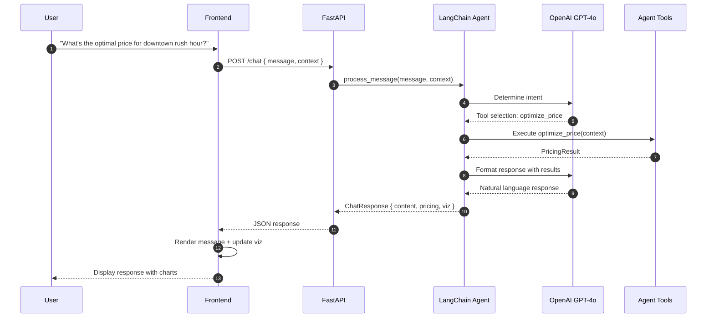

# 8. Core Workflows

## 8.1 Price Optimization Workflow

```mermaid
sequenceDiagram
    autonumber
    participant U as User
    participant FE as Frontend
    participant API as FastAPI
    participant SEG as Segmenter
    participant SIM as Demand Simulator
    participant ML as Model Manager
    participant OPT as Price Optimizer
    participant RULES as Rules Engine
    participant EXP as Explainability

    U->>FE: Submit market context
    FE->>API: POST /optimize_price
    API->>SEG: Classify customer segment
    SEG-->>API: SegmentResult
    
    API->>SIM: Generate demand curves
    SIM-->>API: DemandCurve[]
    
    API->>ML: Predict base price
    ML-->>API: PricePrediction
    
    API->>OPT: Find optimal price point
    OPT->>OPT: Maximize expected revenue
    OPT-->>API: OptimalPrice
    
    API->>RULES: Apply business constraints
    RULES-->>API: AdjustedPrice + RulesApplied
    
    API->>EXP: Generate explanation
    EXP-->>API: PriceExplanation
    
    API-->>FE: PricingResult
    FE-->>U: Display recommendation + viz
```

## 8.2 Chat Interaction Workflow



## 8.3 Scenario Comparison Workflow

```mermaid
sequenceDiagram
    autonumber
    participant U as User
    participant FE as Frontend
    participant API as FastAPI
    participant SVC as Scenario Service
    participant OPT as Price Optimizer

    U->>FE: Select scenarios to compare
    FE->>API: POST /scenarios/compare { ids }
    API->>SVC: Load scenarios
    SVC-->>API: Scenario[]
    
    loop For each scenario
        API->>OPT: Recalculate if needed
        OPT-->>API: Updated result
    end
    
    API->>API: Calculate comparison metrics
    API->>API: Generate insights
    API-->>FE: ScenarioComparison
    FE-->>U: Display comparison table + insights
```

---
