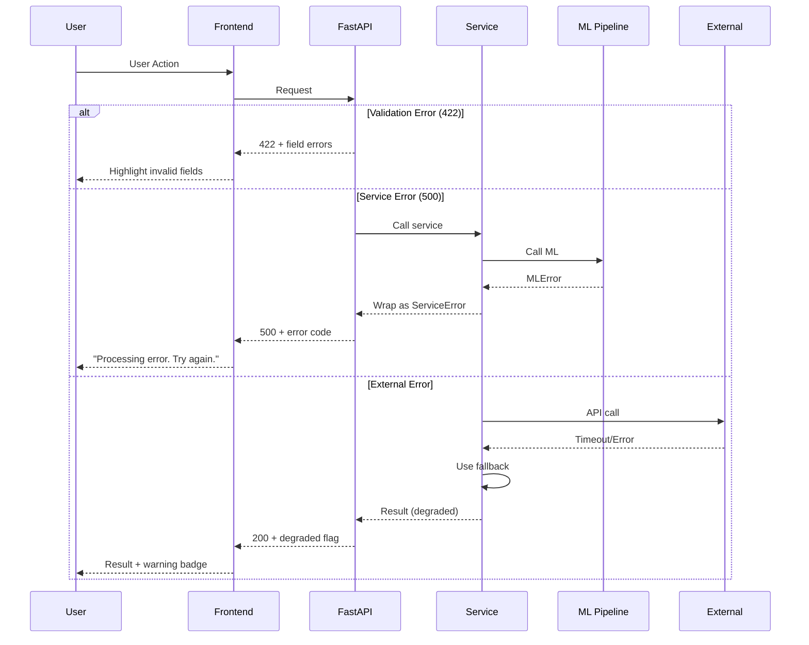

# 18. Error Handling Strategy

## 18.1 Error Flow



## 18.2 Error Codes

```yaml
# Backend error codes
VALIDATION_ERROR: 422      # Invalid input
NOT_FOUND: 404            # Resource not found
SERVICE_ERROR: 500        # Internal error
MODEL_ERROR: 500          # ML prediction failed
EXTERNAL_ERROR: 502       # External service failed
RATE_LIMITED: 429         # Too many requests
LLM_ERROR: 503           # OpenAI unavailable
```

## 18.3 Graceful Degradation

| Failure | Fallback | User Impact |
|---------|----------|-------------|
| OpenAI down | GPT-4o-mini or cached response | Slightly less accurate responses |
| n8n down | Synthetic external data | No real-time weather/events |
| Model error | Segment average price | Less personalized recommendation |
| Frontend error | Error boundary + retry | Clear error message with action |

---
