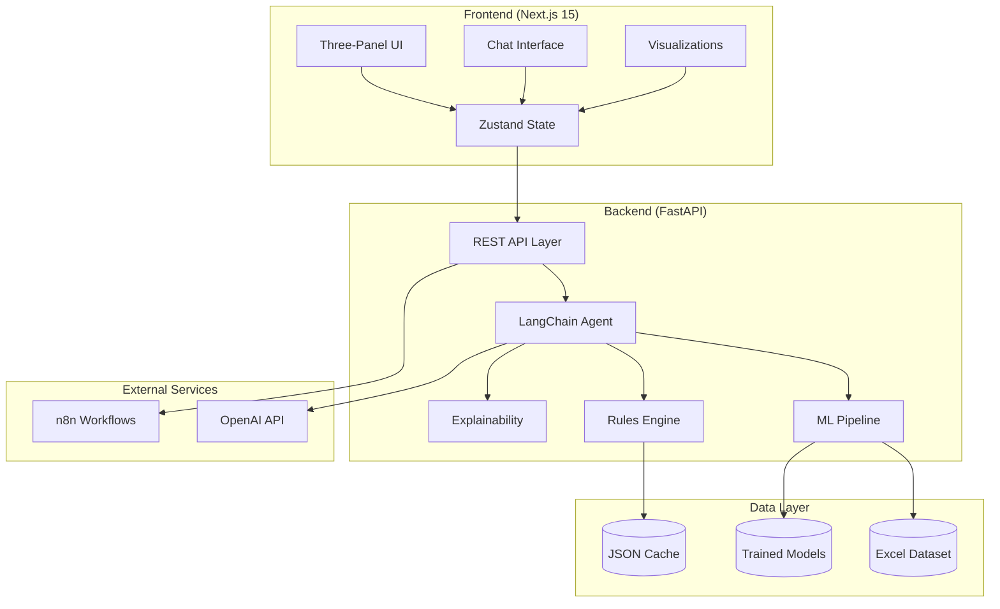
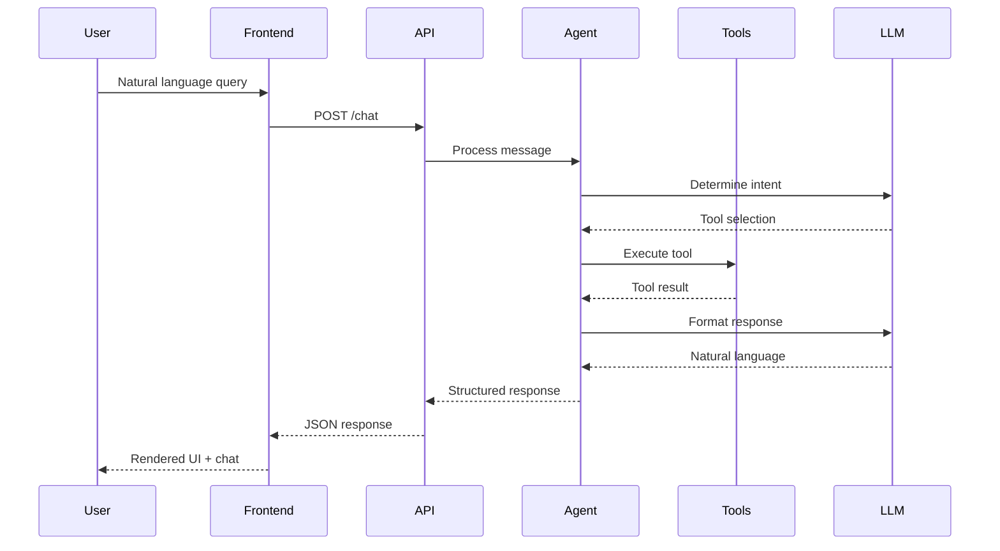

# 2. High Level Architecture

## 2.1 Technical Summary

PrismIQ is architected as a **monolithic fullstack application** with clear frontend/backend separation, deployed locally for hackathon demonstration. The system follows a **chat-first, API-driven pattern** where a Next.js 15 frontend communicates with a FastAPI backend that orchestrates ML models through a LangChain agent.

The frontend renders a three-panel collapsible interface with real-time chat, while the backend exposes REST endpoints that the LangChain agent invokes as tools. Price optimization occurs through an ensemble approach combining XGBoost predictions with SHAP-based explainability.

## 2.2 High-Level Component Diagram

## 2.3 Key Design Principles

1. **Chat-First Architecture:** All user interactions flow through the conversational interface. The agent determines when to invoke tools (price optimization, visualization, etc.) based on user intent.

2. **Tool-Based Agent Design:** The LangChain agent exposes backend services as callable tools, enabling natural language-driven actions without hardcoded workflows.

3. **Graceful Degradation:** When external services fail, the system falls back to cached data or synthetic responses, ensuring uninterrupted demo experience.

4. **Type Safety Across Boundaries:** Shared TypeScript types are the source of truth, with Pydantic models mirroring them for runtime validation.

## 2.4 Request Flow Overview

---
